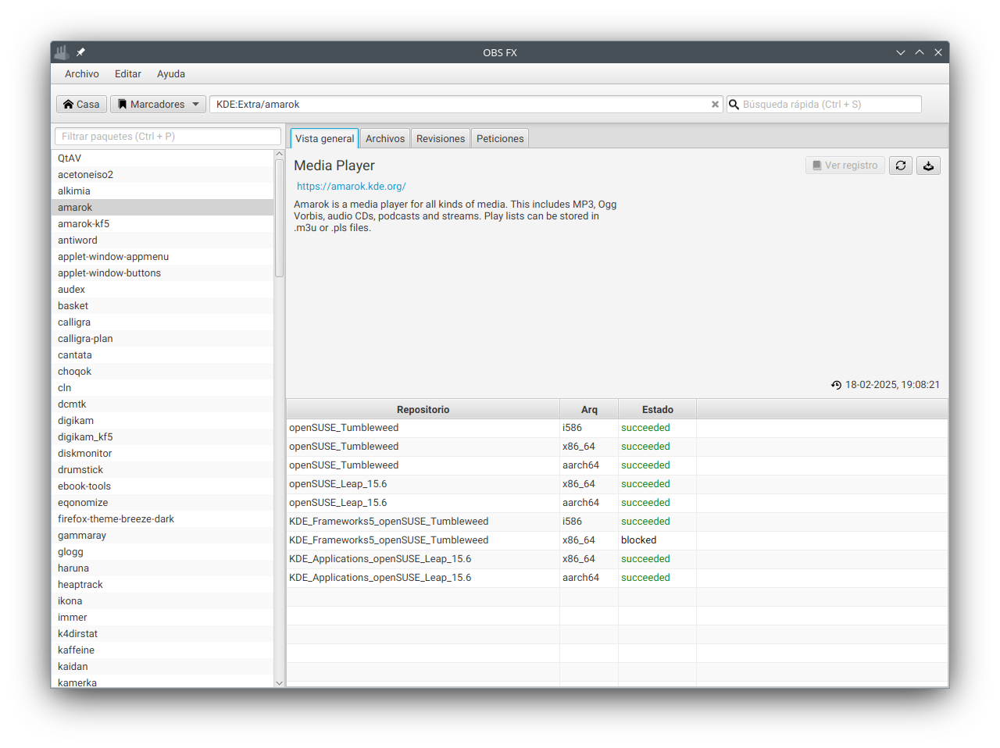

# obsfx
OBS FX a JavaFX-based OBS client

Copyright (C) 2023-2025 Javier Llorente <javier@opensuse.org>

OBS FX is a basic JavaFX-based [Open Build Service](https://openbuildservice.org/) client.
It uses the the [jOBS library](https://github.com/javierllorente/jobs/) to consume the OBS REST API.

Installation
------------
There are three versions:
- rpm package (Linux). Ships with a minimal Java/JavaFX runtime for Linux.
- jre zip (Linux). Ships with a minimal Java/JavaFX runtime for Linux.
- non-jre zip (Any OS). Requires the Java/JavaFX runtime for your OS.
Download it at [Releases](/../../releases)

License
-------
This application is licensed under the Apache License 2.0. See LICENSE for more details.
